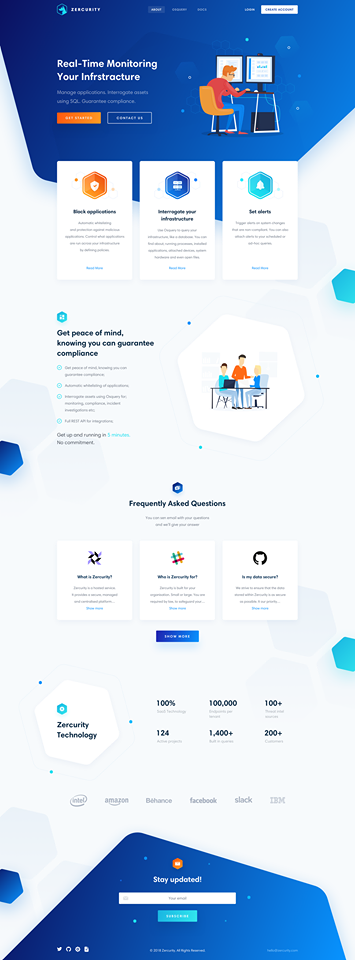

# Landing page (design)

Putting my skills together to design this.\
Note **photoshop** is not one of my skills so it might not 100% the same.\
<!--  -->
<p align="center">
  
</p>

## deploy

you can check from [here](https://mohamed17717.github.io/Landing-Page-Design/dist/)

## Getting Started

### Prerequisites

- [**NodeJs**](https://nodejs.org/en/download/) - to start using npm

### Installing

clone & install npm pakages

```bash
$ git clone https://github.com/mohamed17717/Landing-Page-Design.git <filename>
$ cd <filename>
$ npm install
$ gulp
[19:02:53] Using gulpfile /../gulpfile.js
[19:02:53] Starting 'default'...
[19:02:53] Starting 'watch'...
Server lestening to  http://127.0.0.1:1337
```

just open the url in browser

## Built With

- **SASS** - Preprocessor for css
- **GULP** - Task Runner
